# 总结的IDEA常用配置及插件推荐

[TOC]

### IDEA安装

下载地址：https://www.jetbrains.com/idea/

### IDEA配置：

#### 1.配置JDK

​	新建项目时，可以选择JDK增加。

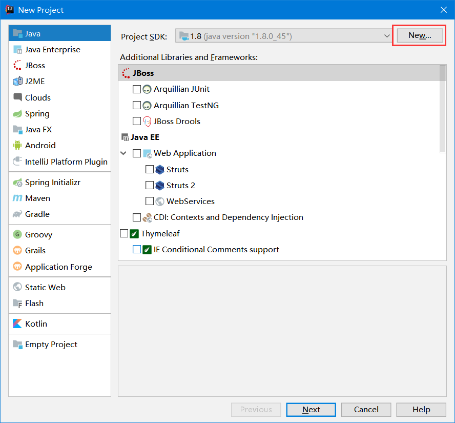

#### 2.字体设置

​	编辑器字体设置：Settings->Editor->Font 设置编辑器字体

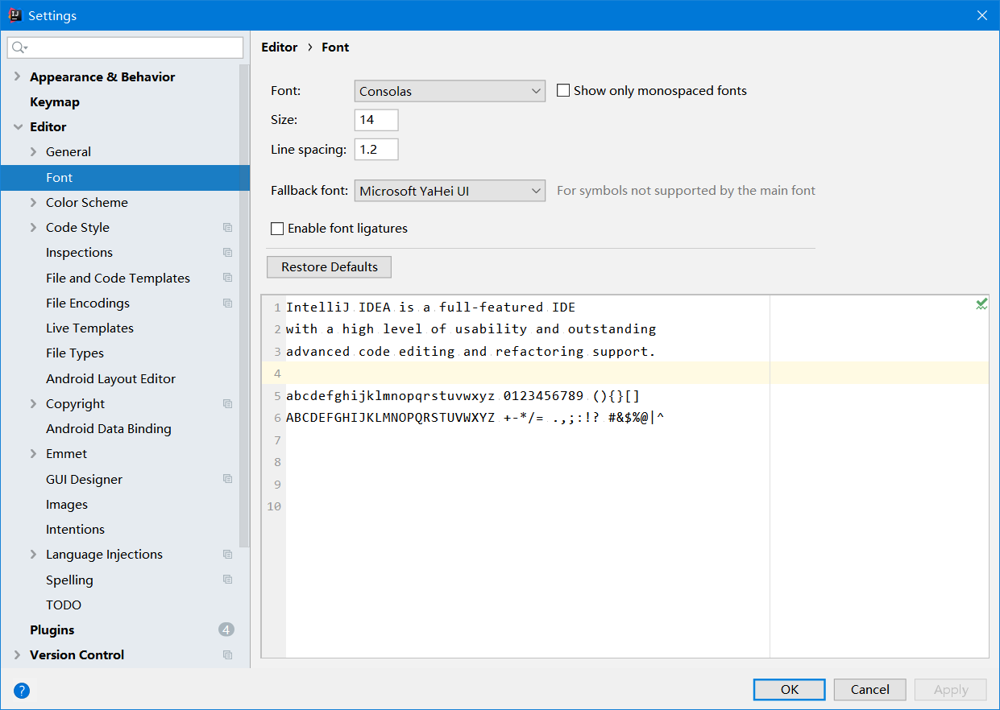

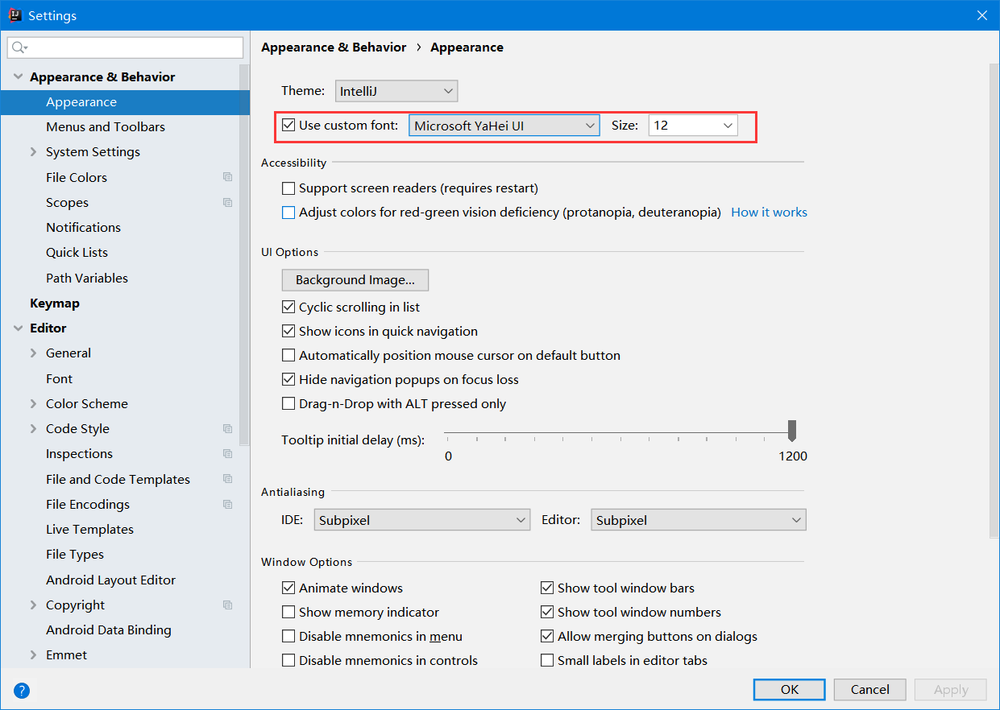

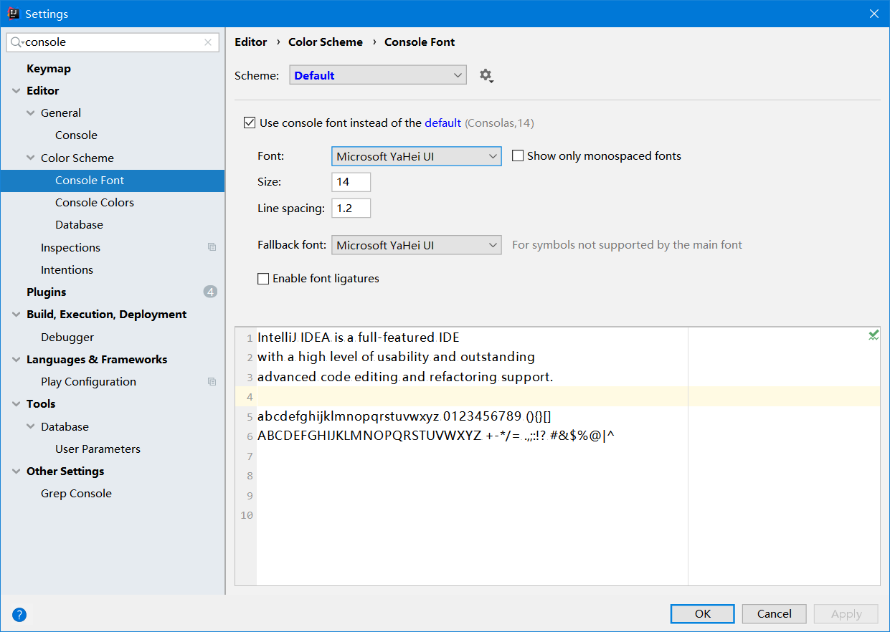

#### 3.关闭IDEA自动更新

​	File->Settings->Appearance & Behavior->System Settings->Updates下取消Automatically check updates for勾选 

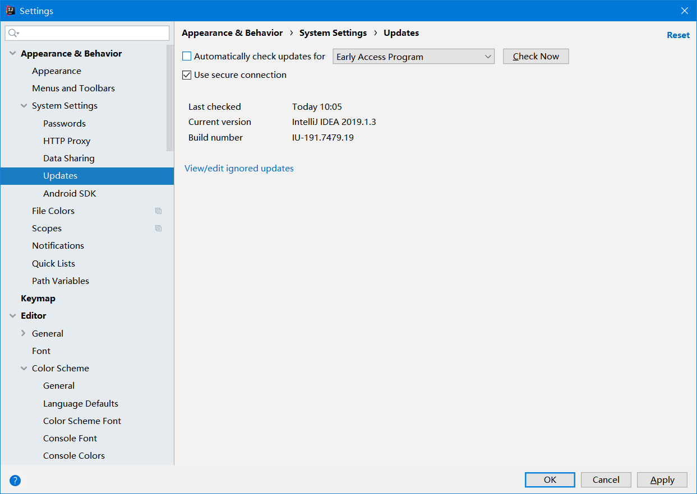

#### 4.隐藏.idea文件夹和.iml等文件

​	File->Settings->Editor->File Types下的”Ignore files and folders”一栏添加 *.idea;*.iml;等配置

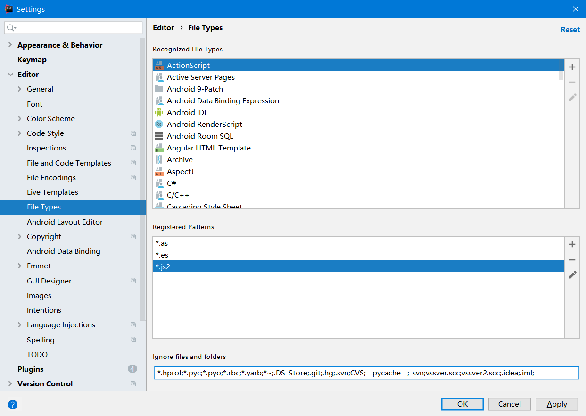

#### 5.文件编码设置

​	1.File->Settings->Editor->File Encodings

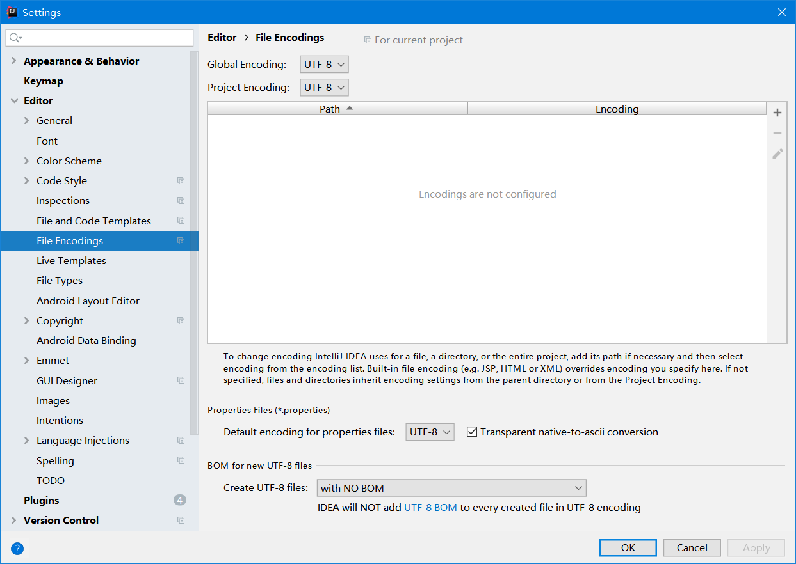

​	2.File->Others Settings->Settings for new projects->Editor->File Encodings

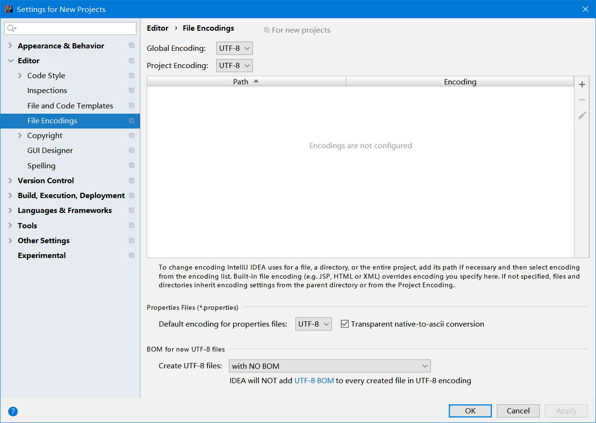

​	3.File->Settings->Build,Execution,Deployment -> Compiler -> Java Compiler

​		设置 Additional command line parameters选项为 -encoding utf-8

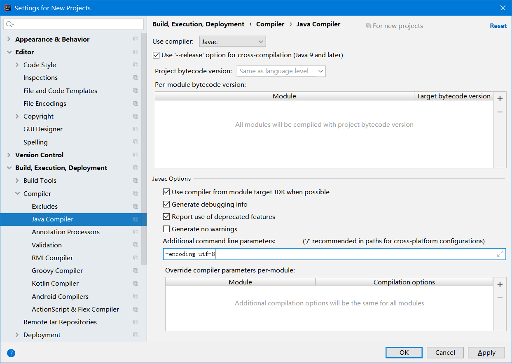

#### 6.自动提示

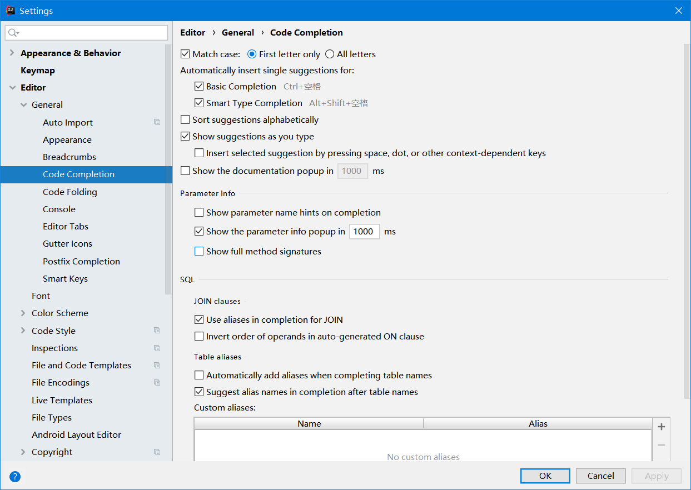

#### 7.自动导包

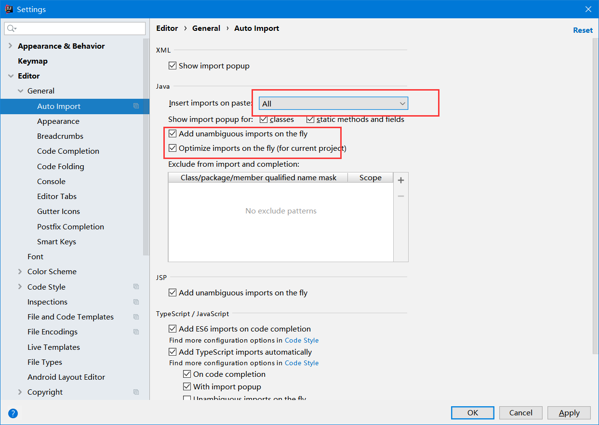

优化引入，假设你引入了一个包下的很多个文件，他就会给你优化成xxx包名.*。也就是下面这个图的配置啦。

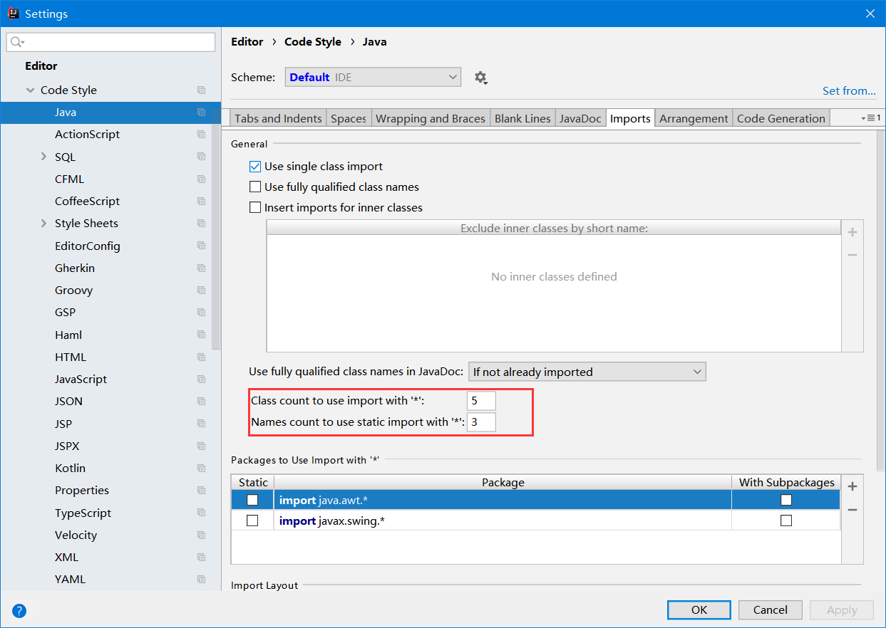

### IDEA使用技巧：

#### 1.快捷键

| 快捷键          | 内容                                                         |
| --------------- | ------------------------------------------------------------ |
| ctrl+E          | 快速打开最近使用的文件列表                                   |
| ctrl+H          | 全局搜索                                                     |
| ctrl+alt+上下键 | 快速复制整行                                                 |
| ctrl+D          | 删除光标所在行                                               |
| ctrl+shift+U    | 切换大小写                                                   |
| shift+shift     | 快速查找文件                                                 |
| Ctrl+[/]        | 诸如{}围起来的代码块，使用该快捷键可以快速跳转至代码块的结尾处 |

### IDEA插件推荐

##### 1.Alibaba Java Coding Guidelines

​	阿里巴巴出品，Java代码规范插件，可以规范化写的代码。

##### 2.CodeGlance

​	代码编辑区迷你缩放图插件

##### 3.FindBugs-IDEA

​	静态代码审查工具，可以审查出代码中存在bug

##### 4.GenerateAllSetter

​	在new对象时，可以自动生成所有的set方法

​	使用方式：

​		alt+enter快捷键选择Generate all setter

##### 5.GrepConsole

​	控制台输出不同级别的日志显示不同颜色

##### 6.GsonFormat

​	自动根据json字符串，生成JavaBean

​	使用方式：

​		alt+insert快捷键选择GsonFormat

##### 7.RestfulToolkit

​	接口自测工具，可以方便的进行接口测试。支持通过【ctrl+\】快捷键输入url，快速导航到Spring MVC对应的方法。

##### 8.Statistic

​	代码统计工具

##### 9.JRebel

​	热部署工具。

​	激活地址：https://tools.hexianwei.com/#/tools/jrebel

​	要想使Jrebel生效，好需要做如下配置：

​	1.开启自动编译

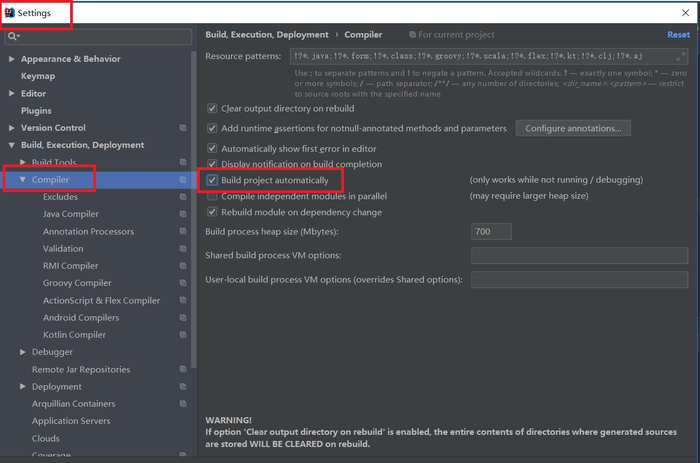

​	2.设置 compiler.automake.allow.when.app.running 。

​		help->find action…打开 
​		搜索registry 找到 compiler.automake.allow.when.app.running 并✔ 

##### 10.Free Mybatis plugin

​	点击dao层方法可以直接跳转到xml。

##### 10.LiveEdit

​	

