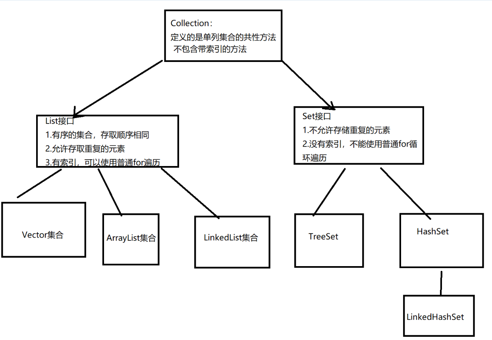

# Java集合用法汇总

## Java常用集合类继承结构



## Collection接口

### 全限定名：`java.util.Collection`

Collection时所有单列机和

### 常用方法：

​	`public boolean add(E e)`：添加元素到集合中

​	`public void clear()`：清空集合中的所有元素

​	`public boolean remove(E e)`：在集合中删除指定的元素

​	`public boolean contains(E e)`：判断集合是否包含指定元素

​	`public boolean isEmpty()`：判断集合是否为空

​	`public int size()`：获取集合中元素的数量

​	`public Object[] toArray()`：集合转换为数组

​	**`public Iterator<E> iterator()`：返回此集合的迭代器**


## Iterator接口

### 全限定名：`java.util.Iterator`

### 常用方法：

​	`public boolean hasNext()`：判断集合还有没有下一个元素

​	`public E next()`：取出集合的下一个元素

### 代码示例：

```Java
Collection col = new ArrayList<String>();

col.add("做全栈攻城狮");
col.add("Java全栈");

Iterator<String> it =coll.iterator();
while(it.hasNext()){
	String s = it.next();
	System.out.printf(s);
}

```

### 增强for遍历集合：

#### **所有的单列集合都可以使用增强for**

```java
Collection<String> coll = new ArrayList<String>();
coll.add("做全栈攻城狮");

for(String s : coll){
	System.out.printf(s);
}
```

## 泛型

泛型的引入避免了类型强制转换异常的麻烦，通过指定泛型更利于代码的维护

### 定义

##### 类上面定义泛型

定义的格式：

```
修饰符 class 类名<代表泛型的变量>{

}
```

代码示例：

```
public class MyClass<E>{
	private E element;
	
	public void setElement(E element){
		this.element = e;
	}
	
	public E getElement(){
		return element;
	}
}

//使用
MyClass<String> my = new MyClass<String>();
my.setElement("做全栈攻城狮");

String ele = my.getElement();

```

##### 方法上面定义泛型

定义格式：

```
修饰符 <代表泛型的变量> 返回值类型 方法名(参数){

}
```

代码示例：

```java
public class MyClass{
	public <E> void show(E element){
		System.out.printf(element);
	}
}
```

##### 接口上面定义泛型

定义格式：

```
修饰符 interface 接口名<代码泛型的变量>{
}
```

代码示例：

```java
public interface MyInterface<E>{
	public void add(E e);
}
//定义接口的实现类实现接口，定义接口的泛型
public class MyClass implements MyInterface<String>{
    public String show(String e){
        return e;
    }
}
//接口类使用什么泛型实现类也使用什么泛型，创建对象的时候确定泛型的类型
public class MyClass implements MyInterface<E>{
    public E show(E e){
        return e;
    }
}
```

###### 通配符

？可以表示未知类型

代码示例：

```
public static void setElement(Collection<?> coll);

```

###### 限定通配符的范围

上限

​	格式： 类型名称 <? extends 类> 对象名称

​	意义：只能接收该类型及其子类

下限

​	格式： 类型名称 <? super 类> 对象名称

​	意义：只能接收该类型及其父类

## List集合

### List接口

#### 全限定名：

​	`java.util.List extends java.util.Collection`

#### List接口的特点：

​	1.存取元素的顺序相同

​	2.带索引，可以使用普通for循环进行遍历

​	3.可以存储重复的数据

#### 常用方法：

​	除了继承`java.util.Collection`中的方法之外，还有如下它自己自己的常用方法：

- public void add(int index , E element)：将执行的元素添加到集合指定位置上
- public E get(int index)：根据索引获取元素数据
- public E remove(int index)：移除指定索引的元素
- public E set(int index, E element)：替换指定索引的元素，返回替换前的元素

### ArrayList集合

#### 全限定名：

​	`java.util.ArrayList implement List ` 

#### 特点

1. 内部数据存储结构为数组
2. 元素增删慢，查找快

### LinkedList集合

#### 全限定名：

​	`java.util.LinkedList implement List`

#### 特点

1. 内部数据存储结构采用链表结构
2. 元素添加删除快，查询速度慢

#### 特有常用方法：

- public void addFirst(E e)：将元素添加到列表的开头
- public void addLast(E e)：将元素添加到元素的结尾
- public E getFirst()：获取列表的第一个元素
- public E getLast()：获取列表的最后一个元素
- public E removeFirst()：移除列表的第一个元素
- public E removeLast()：移除并返回此列表的最后一个元素
- public E pop()：从此列表表示的堆栈中弹出一个元素
- public void push(E e)：将元素推入此元素表示的堆栈
- public boolean isEmpty()：判断元素是否为空


## Set集合

### Set接口

#### 全限定名：

​	`java.utils.Set extends Collection`

#### 特点：

1. Set接口中存储的元素的顺序是无序
2. Set集合中的元素不允许重复
3. 没有索引，不能使用普通for循环遍历

### HashSet集合

全限定名：

​	`java.util.HashSet`

注意：

1. 底层是一个哈希表结构，1.8之前采用链表+数组实现，JDK1.8中采用数组+链表+红黑树（当链表长度大于8时，自定转换为红黑树）
2. 集合中存储重复的数据，会存储不上。
3. 如果需要把自定义的对象添加到Set集合中，需要重写hashCode和equals方法以保证元素唯一

代码示例

```java
Set<Integer> set = new HashSet<>();

set.add(1);
set.add(2);
set.add(3);

//迭代器遍历
Interator<Integer> it = set.iterator();
while(it.hasNext()){
	Integer n = it.next();
}

//增强for遍历
for(Integer i : set){
	System.out.println(i);
}

```

### LinkedHashSet集合

全限定名：

​	`java.util.LinkedHashSet extends HashSet`

特点：

1. 保证了元素有序
2. 底层为哈希表+链表，链表记录了存储数据

