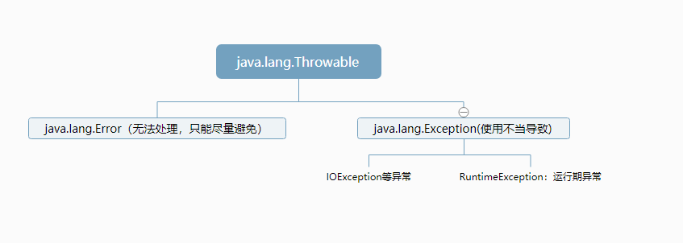

# Java异常处理

## Java异常体系：



## Throwable类

常用方法：

​	`public void printStackTrace()`：打印异常的详细信息

​	`public String getMessage()`：获取发生异常的原因

​	`public String toString()`：获取异常的类型和异常描述信息（一般不用）

## 异常的处理

### 抛出异常

示例：

```java
throw new NullPointerException("空指针异常");
throw new ArrayIndexOutOfBoundsException("该索引不存在")
...
```

扩展：

​	使用Objects.requireNonNull(obj,"传递的对象时null值")；可以实现对null值抛出异常

### 声明异常

在代码中抛出异常后，必须进行处理异常。可以通过在方法上声明异常的方式，交由调用者处理异常。

格式：

​	`修饰符 返回值类型 方法名(参数) throws 异常类1,异常类2{ }`

### 捕获异常

格式：

```java
try{

}catch(异常类型 e){
	//处理异常的代码
}finally{
	//不管如何finally中的代码都会执行
}
```

## 自定义异常

格式：

```
public class XXXException extends Exception | RuntimeException{
	添加一个空参构造方法
	添加一个带异常信息的构造方法
}
```

注意：

1. 一般情况下自定义异常类采用Exception结尾，代表是一个异常类
2. 继承Exception：编译器异常，就必须处理这个异常
3. 继承RuntimeException：运行期异常，无需处理
4. 带异常信息的构造方法，内部会调用父类带参数构造方法，让父类来处理此异常


